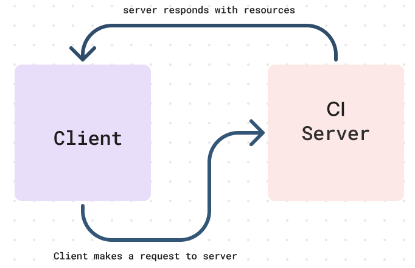

# Basic Express Server

**Author**: Wajiha Khan

**Version**: 1.0.0

**Overview**:

I built an express server with a person route. This route expects a query string with a name property. If the name is provided, it responds with a JSON object containing the name, otherwise it returns an error. The project structure includes an index file for server initialization, middleware modules for logging and input validation, and error handling modules for 404 and 500 responses. This approach ensures a well-structured and efficient server setup.

